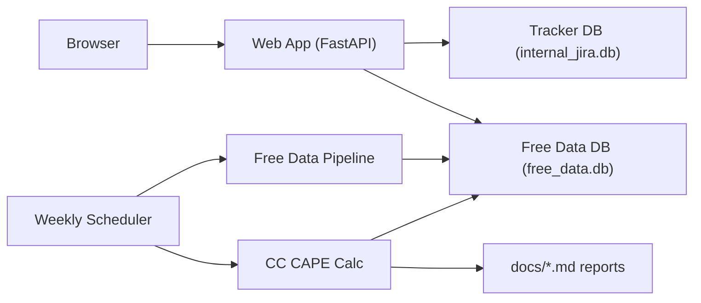

# ccCAPE Architecture (Internal)

Date: 2026-02-13

## Overview

ccCAPE is an internal research tool for producing and tracking a **free-data proxy** of Current Constituents CAPE (CC CAPE), plus a lightweight internal tracker (Jira-like).

Core goals:

- Deterministic, auditable calculations (given the same inputs).
- Clear lineage to upstream sources (SEC / FRED / Wikipedia / Multpl / Stooq).
- Usable internal UI for roadmap tracking and metric review.

## Components

1. Tracker database (`data/internal_jira.db`)
- SQLite
- Roadmap epics/issues/comments/dependencies
- Users/roles (admin/editor/viewer)
- Access audit logs (best-effort request telemetry)

2. Web app (`web_app.py`)
- FastAPI + Jinja templates
- Session auth + role gating for admin pages
- Read-only access to the free-data DB for metrics pages

3. Free-data database (`data/free_data.db`)
- SQLite
- Raw ingested datasets + curated calculation outputs

4. Ingestion pipeline (`scripts/free_data_pipeline.py`)
- Fetches/updates raw datasets:
  - Wikipedia constituents (S&P 500 snapshot + CIK)
  - SEC company facts (XBRL)
  - FRED CPI (CPIAUCSL)
  - Multpl Shiller CAPE monthly table (proxy benchmark)
  - Stooq daily prices (free price history)
- Writes step logs to `ingestion_runs`
- Posts status summaries to tracker issues (optional)

5. Calculation engine (`scripts/calc_cc_cape_free.py`)
- Reads raw tables in `free_data.db`
- Computes company CAPE per constituent and a weighted CC CAPE
- Persists results (`cc_cape_runs`, `cc_cape_constituent_metrics`)
- Auto-looks up Shiller CAPE and computes spread
- Adds run-history percentiles/z-scores

6. Historical backfill (`scripts/backfill_cc_cape_series_free.py`)
- Produces a monthly CC CAPE series (`cc_cape_series_monthly`) holding the *current* constituent set fixed.

7. Scheduler (`scripts/weekly_scheduler.py`)
- Runs ingestion + calculation on a weekly cadence (Docker service `cccape-weekly`)

## Data Flow

## Storage Model

Two SQLite databases:

- `internal_jira.db`: operational tracker + access audit
- `free_data.db`: ingestion + computed metrics

The tool is intentionally simple: SQLite + scripts + a web UI, with Docker Compose for consistent execution.

## Lineage / Auditability

Ingestion tables include fields like:

- `source_url`
- `ingested_at` / `fetched_at`

The pipeline writes step-level records into `ingestion_runs` (including a JSON payload with row counts and warnings).

Calculation outputs include:

- an explicit `run_at`
- an `as_of_constituents_date`
- a `latest_price_date`
- `notes_json` describing coverage/assumptions

## Deployment Model

Docker Compose services:

- `cccape` (web app): port `8000`
- `cccape-weekly` (scheduler): background job runner

Persistent volumes:

- `./data` mounted to `/app/data`
- `./docs` mounted to `/app/docs`

## Security Model (Internal)

- Session auth required for UI + APIs.
- Roles:
  - `admin`: can manage users, view audit logs
  - `editor`: can update issues/comments/dependencies
  - `viewer`: read-only

This is not hardened for public internet exposure; treat as internal-only.

